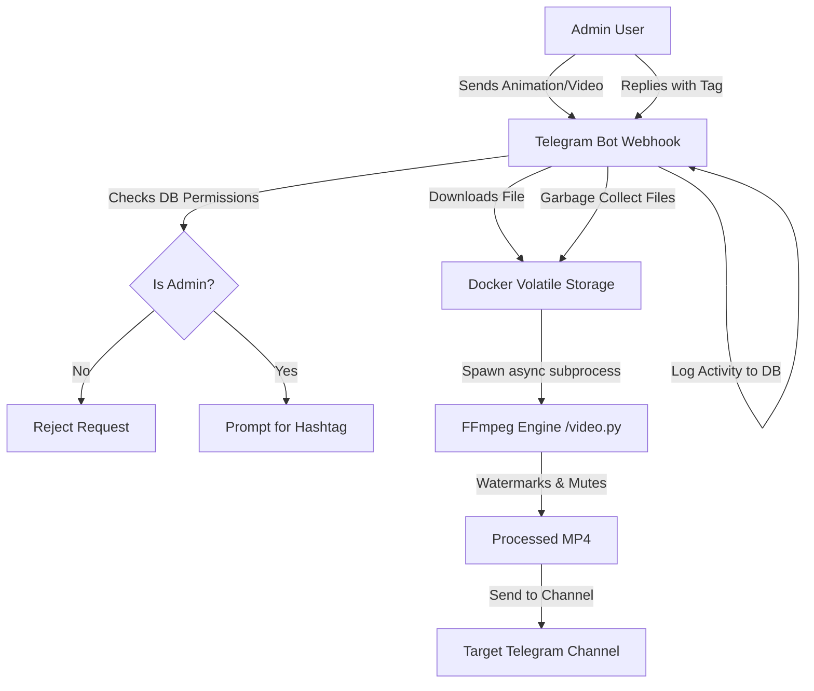

<div align="center">
  <h1>🎬 Trend GIF Telegram Bot</h1>
  <p><strong>A fully automated, asynchronous Telegram bot with FFmpeg integration and CI/CD pipelines.</strong></p>
  
  [](https://python.org)
  [](https://docker.com)
  [](https://ffmpeg.org)
  [](https://python-telegram-bot.org/)
  [](https://github.com/features/actions)

  <br>
  <i>Read this in <a href="README_FA.md">Persian (فارسی)</a></i>
</div>

---

## 📌 Overview
An enterprise-grade, asynchronous Telegram Bot designed to streamline media publishing for Telegram channels. It processes video and animation (GIF) files, applies customized text watermarks dynamically using **FFmpeg**, and publishes them to a target channel—all while running securely in an isolated Docker container via **HTTPS Webhooks**.

This project serves as a showcase of modern Python backend development, DevOps practices (Docker + CI/CD), and robust API integration.

## 🚀 Key Features

*   **Asynchronous Webhook Architecture**: Transitioned from polling to a secure, high-performance HTTPS webhook model for production readiness.
*   **Media Processing Engine**: Seamless integration with FFmpeg via `asyncio.subprocess` to manipulate video streams, apply styling (shadows, fonts), and strip audio tracks dynamically.
*   **DevOps & CI/CD Pipeline**: Fully automated deployments to a remote server using GitHub Actions, SCP, and SSH. 
*   **Dockerized Environment**: The bot and all its complex system dependencies (like FFmpeg) are encapsulated in a lightweight container, ensuring complete environment parity.
*   **State Management without FSM**: Clever use of Telegram's `ForceReply` and `context.chat_data` mapping to track active video processing sessions seamlessly.
*   **Strict Access Control**: Granular permission layers ensuring only the `OWNER_ID` or registered `admins` in the local SQLite database can trigger commands.

## 🛠️ Tech Stack & Architecture

- **Language:** Python 3.13
- **Framework:** `python-telegram-bot` (v20+)
- **Database:** SQLite3
- **Media Processing:** FFmpeg
- **Infrastructure:** Docker, Docker Compose
- **CI/CD:** GitHub Actions (Automated SSH & SCP)

### System Workflow


## 📁 Repository Structure

*   `bot.py`: The main asynchronous webhook application. Handles request routing, state management, and API calls.
*   `video.py`: The FFmpeg media processing pipeline, utilizing `asyncio.create_subprocess_exec`.
*   `db.py`: The Data Access Object (DAO) managing SQLite connections, admin whitelists, and logging.
*   `Dockerfile` & `docker-compose.yml`: Container orchestration definitions.
*   `.github/workflows/deploy.yml`: The CI/CD pipeline for automated deployments.

## ⚙️ Configuration & Environment Variables

The bot utilizes environment variables to ensure secrets are never leaked into version control. You must provide these variables either in a `.env` file or directly in the CI/CD pipeline (via GitHub Secrets):

| Variable | Description | Example |
| :--- | :--- | :--- |
| `BOT_TOKEN` | Token provided by @BotFather | `123456789:ABCDEF...` |
| `IP_ADDRESS` | Public IP of the host server | `45.91.248.25` |
| `PORT` | Webhook listening port | `8443` |

*Note: For the webhook to function securely, `public.pem` and `private.key` SSL certificates must exist in the root directory.*

## 🚀 Deployment (CI/CD)

This project features a fully automated CI/CD pipeline. Pushing to the `main` branch triggers a GitHub Action that:
1. Connects to the host server via SSH.
2. Synchronizes the latest codebase securely using SCP.
3. Injects the production secrets into a `.env` file dynamically.
4. Rebuilds and restarts the Docker containers seamlessly without downtime.

### Manual Local Setup (Development)

1. Clone the repository and navigate inside.
2. Create a `.env` file based on `.env.example`.
3. Run with Docker Compose:
```bash
docker compose up -d --build
```

## 🛡️ Administrative Commands (Owner Only)
*   `/start`: Bot health check.
*   `/add_admin <user_id>`: Whitelists a new administrator.
*   `/add_tag <hashtag>`: Registers a new category tag.
*   `/remove_tag <hashtag>`: Deletes an existing tag.
*   `/report`: Generates monthly activity statistics per administrator.
