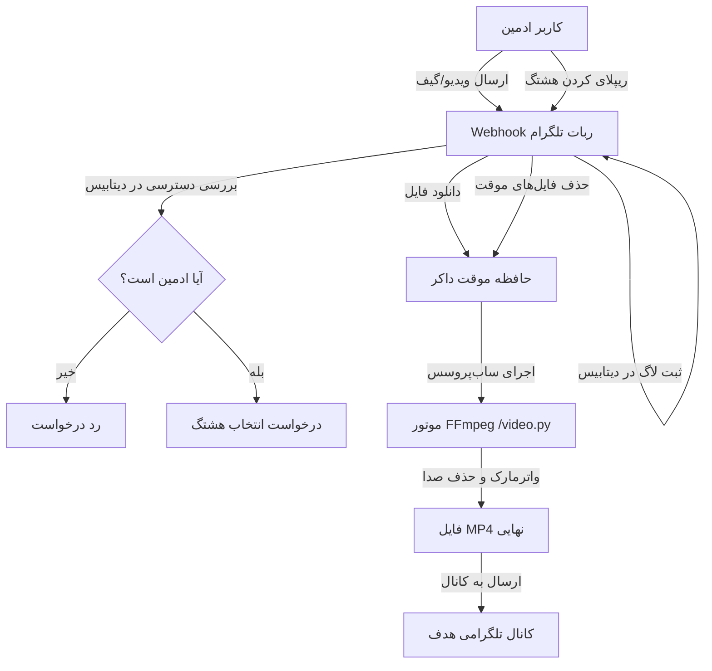

  <h1>🎬 ربات تلگرامی Trend GIF</h1>
  
<strong>یک ربات تلگرامی تمام خودکار و Asynchronous با ادغام FFmpeg و خط لوله CI/CD.</strong>

  
  
  
  
  
  

   
  <i>این متن را به زبان <a href="README.md">انگلیسی (English)</a> بخوانید.</i>

---

## 📌 معرفی پروژه
یک ربات تلگرامی در سطح تجاری که برای تسهیل فرایند انتشار محتوای رسانه‌ای در کانال‌های تلگرامی طراحی شده است. این ربات فایل‌های ویدیویی و انیمیشن (GIF) را پردازش کرده، واترمارک متنی سفارشی را به صورت پویا با استفاده از **FFmpeg** بر روی آن‌ها اعمال می‌کند و سپس در کانال هدف منتشر می‌سازد. تمامی این فرایندها درون یک محیط ایزوله و امن با استفاده از **داکر (Docker)** و معماری **Webhook** بستر HTTPS اجرا می‌شوند.

این پروژه نمایانگر مهارت در توسعه بک‌اند مدرن با پایتون، مفاهیم DevOps (همچون داکر و CI/CD) و کار با API های پیچیده است.

## 🚀 ویژگی‌های کلیدی

*   **معماری Webhook ناهمگام (Asynchronous)**: مهاجرت از سیستم کند Polling به یک مدل Webhook پرسرعت و ایمن مناسب برای محیط‌های پروداکشن (Production).
*   **موتور پردازش رسانه**: ادغام یکپارچه با FFmpeg از طریق `asyncio.subprocess` برای دستکاری جریان‌های ویدیویی، اعمال استایل‌های گرافیکی (سایه، فونت) و حذف صدای ویدیوها به صورت کاملاً داینامیک.
*   **خط لوله CI/CD و DevOps**: استقرار (Deployment) تمام خودکار کدها بر روی سرور از طریق GitHub Actions، به همراه همگام‌سازی فایل‌ها (SCP) و اجرای دستورات (SSH).
*   **محیط کانتینری (Dockerized)**: ربات و تمامی نیازمندی‌های سیستمی آن (مانند ابزار FFmpeg) درون یک کانتینر سبک پکیج شده‌اند تا پایداری و اجرای صحیح روی هر سروری تضمین شود.
*   **مدیریت وضعیت بدون نیاز به FSM**: استفاده هوشمندانه از قابلیت `ForceReply` تلگرام و مپینگ `context.chat_data` برای ردیابی و مدیریت نشست‌های پردازش ویدیو.
*   **کنترل دسترسی دقیق**: لایه‌های دسترسی سفت‌وسخت به گونه‌ای که تنها شناسه ادمین اصلی (`OWNER_ID`) یا ادمین‌های ثبت‌شده در دیتابیس SQLite مجاز به استفاده از ربات هستند.

## 🛠️ تکنولوژی‌ها و معماری

- **زبان برنامه‌نویسی:** Python 3.13
- **فریم‌ورک:** `python-telegram-bot` (v20+)
- **پایگاه داده:** SQLite3
- **پردازش مدیا:** FFmpeg
- **زیرساخت:** Docker, Docker Compose
- **استقرار خودکار (CI/CD):** GitHub Actions

### جریان کاری سیستم

## 📁 ساختار مخزن (Repository)

*   `bot.py`: نقطه ورود اصلی برنامه با استفاده از معماری Webhook.
*   `video.py`: خط لوله پردازش رسانه با FFmpeg.
*   `db.py`: مدیریت ارتباط با دیتابیس SQLite و لاگ‌ها.
*   `Dockerfile` و `docker-compose.yml`: فایل‌های تنظیمات داکر.
*   `.github/workflows/deploy.yml`: اسکریپت استقرار خودکار کدهای گیت‌هاب اکشنز.

## ⚙️ متغیرهای محیطی (Environment Variables)

برای حفظ امنیت، هیچ رمزی نباید در کدها قرار بگیرد. برای اجرای ربات باید متغیرهای زیر را از طریق فایل `.env` یا بخش Secrets گیت‌هاب اکشن مقداردهی کنید:

| متغیر | توضیحات | مثال |
| :--- | :--- | :--- |
| `BOT_TOKEN` | توکن دریافتی از BotFather | `123456789:ABCDEF...` |
| `IP_ADDRESS` | آی‌پی سرور اصلی شما | `45.91.248.25` |
| `PORT` | پورت شنود Webhook | `8443` |

*نکته: برای عملکرد صحیح Webhook روی سرور، فایل‌های گواهینامه SSL یعنی `public.pem` و `private.key` باید در کنار فایل‌های پروژه قرار داشته باشند.*

## 🚀 استقرار روی سرور (CI/CD)

با پوش (Push) کردن کدها به برنچ `main`، یک اکشن در گیت‌هاب به صورت خودکار فعال می‌شود که:
1. از طریق پروتکل SSH به سرور متصل می‌شود.
2. با استفاده از SCP فایل‌های جدید را روی سرور کپی می‌کند.
3. فایل `.env` را با استفاده از Secret های ذخیره‌شده به شکل امن می‌سازد.
4. کانتینرهای داکر را با تغییرات جدید بیلد (Build) و ری‌استارت می‌کند.

## 🛡️ دستورات ادمین اصلی (Owner)
*   `/start`: بررسی وضعیت و سلامت ربات.
*   `/add_admin <user_id>`: افزودن یک شناسه به عنوان ادمین مجاز.
*   `/add_tag <hashtag>`: ثبت هشتگ جدید در دسته‌بندی‌ها.
*   `/remove_tag <hashtag>`: حذف هشتگ.
*   `/report`: دریافت گزارش ماهانه از فعالیت تمامی ادمین‌ها.
